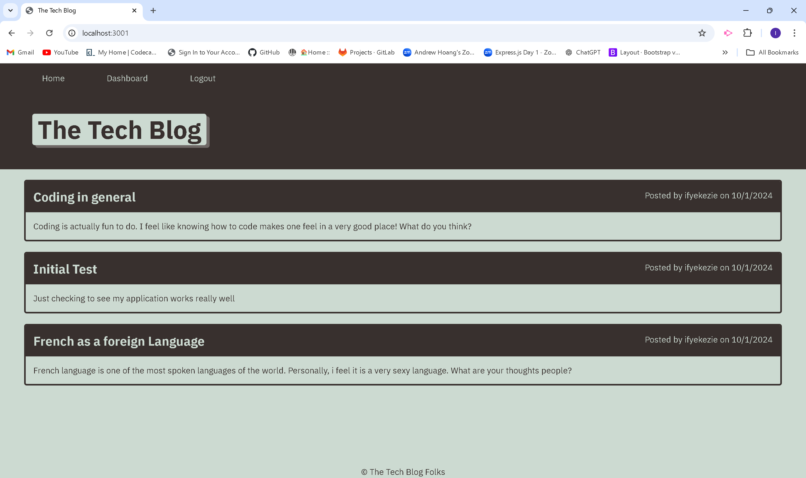

# Blog_vista
Blog_vista is a dynamic platform for developers to share insights, publish posts, and engage in meaningful discussions.

## Description
This is a CMS-style blog site where developers can publish posts and comment on others'. Built from scratch, it follows the MVC pattern, using Handlebars.js for templating, Sequelize as the ORM, and express-session for authentication. The app is deployed on Render. The app is deployed on Render for easy access.

## Table of Contents
- [Installation](#installation)
- [Usage](#usage)
- [Technologies](#)
- [Features](#)
- [License](#license)
- [Contributing](#contributing)
- [Questions](#questions)


## Installation
Clone the repository: git clone https: https://github.com/Ifylee/blog_vista

**Install Dependencies:**
To install dependencies:

```
Run npm install

```
**Evironment variables:**
Set up the environment variables by creating a .env file in the root directory and include the following:
- DB_NAME='your_database_name'
- DB_USER='your_database_user'
- DB_PASSWORD='your_database_password'
- SESSION_SECRET='your_secret_key'

**To run the application:**
Run npm start

## Usage
Once the app is running, you can:

- Create a user account.
- Log in and create, edit, or delete your blog posts.
- Comment on other developers' blog posts.
- Log out when finished.

**Deployed Link:**
Check out the live application on Render here:

## Technologies
- Node.js: JavaScript runtime
- Express.js: Web framework for Node.js
- Sequelize: ORM for database interactions
- Postgres: Relational database management system
- Handlebars.js: Templating engine for rendering views
- express-session: Middleware for managing user sessions
- bcrypt: For password hashing and security

## Features
- User authentication using express-session.
- MVC architecture to maintain separation of concerns.
- User can create, read, update, and delete (CRUD) blog posts.
- Comment functionality on blog posts.
- Fully responsive design.
- Secure authentication and session management.


## License
This project is licensed under the MIT License. See the LICENSE file for details.

## Contributing
Contributions are welcome!

## Questions

  For more questions, please open an issue on my github: [ifylee](https://github.com/Ifylee/blog_vista)

  You can also contact me directly at: [ifyekezie@yahoo.co.uk](mailto:ifyekezie@yahoo.co.uk)

This README provides a clear description, setup instructions, and highlights the key technologies and features of the project. Let me know if you'd like any changes!

**Screenshots of my application**




